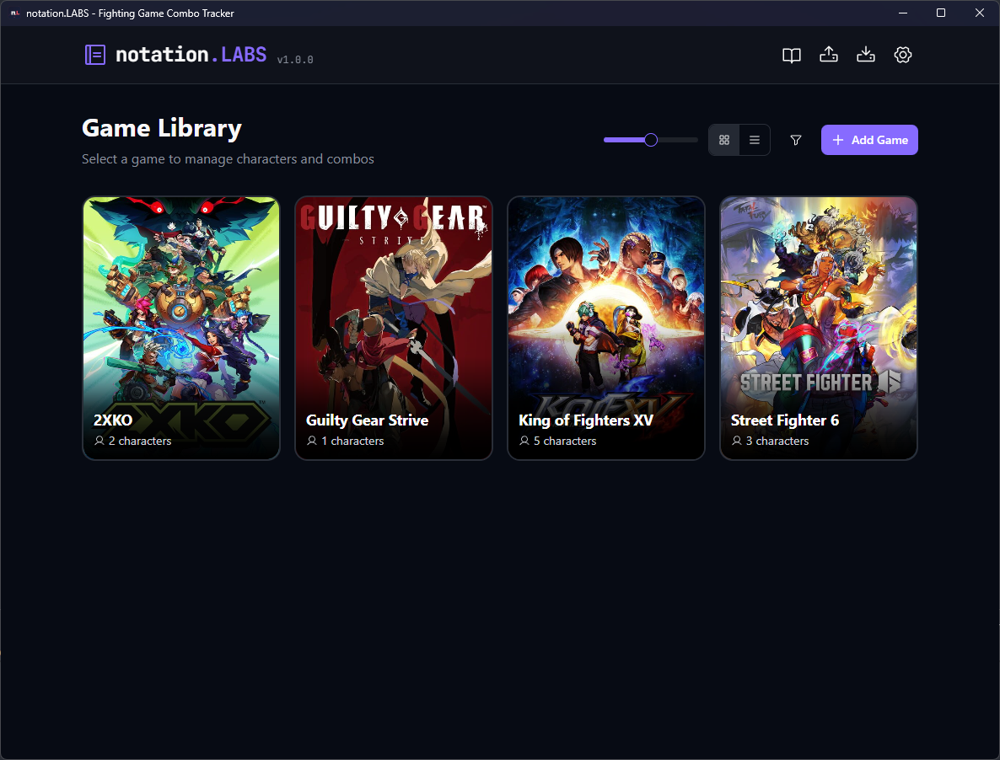
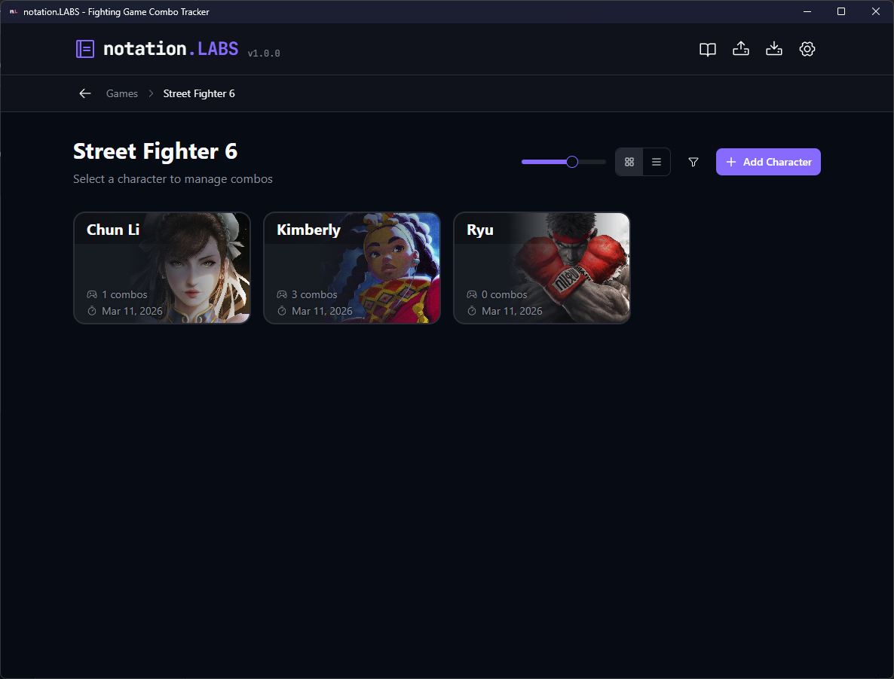
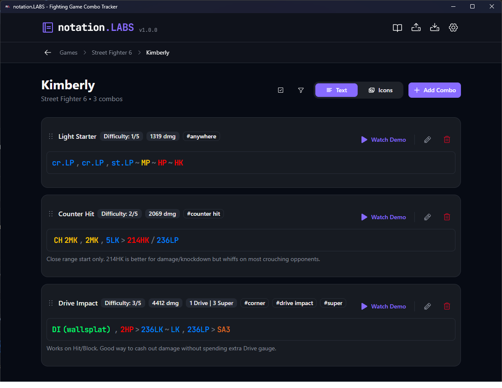
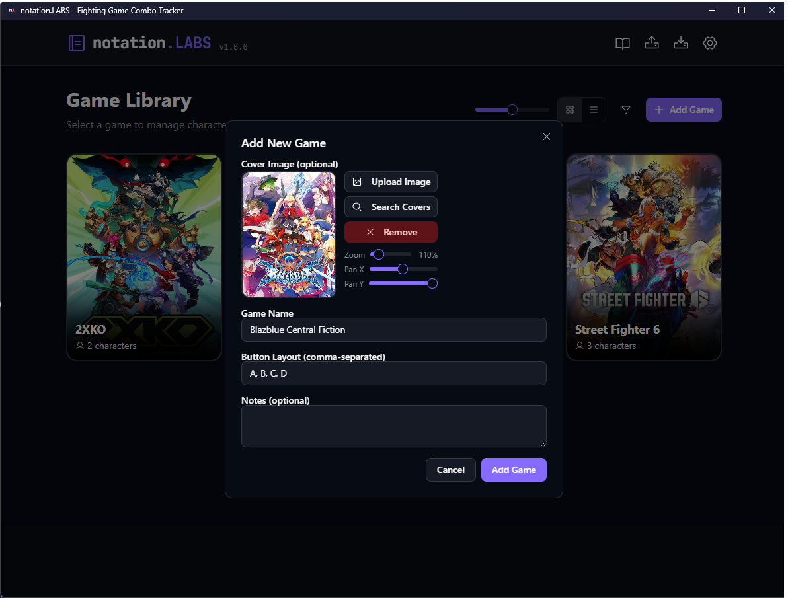
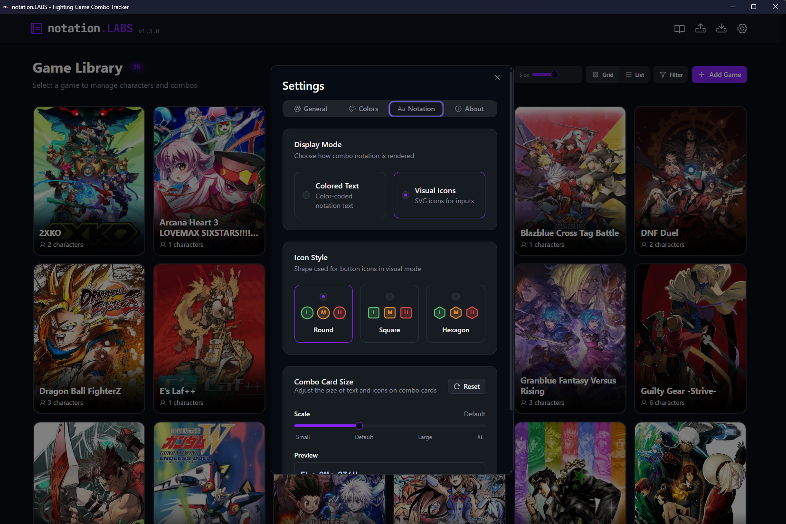

<div align="center">


**A combo tracker for fighting game players**

Build, visualize, organize, and share combos using standard fighting game notation with graphical input displays.

[](https://www.electronjs.org/)
[](https://react.dev/)
[](https://www.typescriptlang.org/)
[](https://vitejs.dev/)
[](LICENSE)

</div>

---

## ✨ Features

- **Various Notation Styles** — Fully supports numpad (`236H`, `623K`), traditional (`qcf`, `dp`), and full (`standing Light Punch`, `quarter circle forward`) notations
- **Dual Display Modes** — Toggle between custom colored text and visual icon display for combos
- **Beautiful Organization** — Organize your combos by game and character with cover images
- **Import / Export** — Backup, restore, and share your entire library or individual combos as JSON
- **Search & Filter** — Search across combo names, tags, and descriptions with multiple filters
- **Video Demonstrations** — Attach local videos or YouTube links to combos for visual reference
- **Offline-First** — All data stored locally via IndexedDB — no account, no cloud, no tracking
- **Auto-Updates** — Built-in update system keeps you on the latest version

## 📸 Screenshots

<details>
<summary>🎮 Game Library</summary>


*Browse and manage your fighting game collection*

</details>

<details>
<summary>🥊 Character Select</summary>


*Select a character to view and manage their combos*

</details>

<details>
<summary>📝 Combo View — Text Mode</summary>


*View combos with colored notation text and tags*

</details>

<details>
<summary>➕ Adding a Combo</summary>


*Create combos with notation, tags, and video demonstrations*

</details>

<details>
<summary>⚙️ Settings</summary>


*Customize display, notation colors, and button layouts*

</details>

## 🚀 Getting Started

### Option 1: Online Demo (No Install)

1. Visit <a href="https://labs.kevinkickback.com/" target="_blank"><b>labs.kevinkickback.com</b></a> to try notation.LABS instantly in your browser. Not all features available.


### Option 2: Download Release (Recommended)

1. Download the latest installer or portable `.exe` from the [Releases](https://github.com/kevinkickback/notation.LABS/releases/latest) page
2. Run the installer or open the app

### Option 3: Build from Source

**Prerequisites:** [Node.js](https://nodejs.org/) (v18 or later)

```bash
git clone https://github.com/kevinkickback/notation.LABS.git
cd notation-labs
npm install
npm run dev
```

## 🕹️ Notation Reference

| Notation | Meaning |
|----------|---------|
| `>` | Proceed from the previous move to the following move |
| `\|>` / `(Land)` | Indicate that the player must land at that point in the sequence |
| `,` | Link the previous move into the following move |
| `~` | Cancel the previous special into a follow-up |
| `dl.` | Delay the following move |
| `(whiff)` | The move must whiff (not hit) |
| `cl.` | Close |
| `f.` | Far |
| `j.` | Jumping/Aerial |
| `dj.` | Double Jump |
| `sj.` | Super Jump |
| `jc.` | Jump Cancel |
| `sjc.` | Super Jump Cancel |
| `dd.` / `22` | Double Down |
| `back dash` / `44` | Back Dash |
| `dash` / `66` | Forward Dash |
| `CH` | Counter Hit |
| `[X]` | Hold input |
| `(sequence) xN` | Repeat sequence N amount of times |
| `(N)` | Hit N of a move or move must deal N amount of hits |
| `qcf.` / `236` | Quarter Circle Forward |
| `qcb.` / `214` | Quarter Circle Back |
| `dp.` / `623` | Dragon Punch |
| `rdp.` / `421` | Reverse Dragon Punch |
| `hcf.` / `41236` | Half Circle Forward |
| `hcb.` / `63214` | Half Circle Back |
| `2qcf.` / `236236` | Double Quarter Circle Forward |
| `2qcb.` / `214214` | Double Quarter Circle Back |

## 📄 License

This project is licensed under the GNU General Public License v3.0 or later — see the [LICENSE](LICENSE) file for details.
